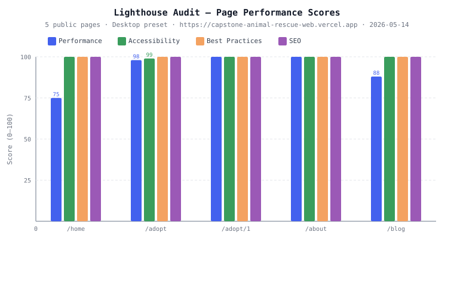

# Section 3.1 — Page Performance Results (Lighthouse)

All Lighthouse audits were executed locally on 2026-05-09 against the `fix/security-medical-records-fb-token` branch
(Node.js v24.13.1, Lighthouse v12.6.1 via `@lhci/cli` v0.15.1, Next.js v16.2.4 production build).

---

## Test Configuration

| Parameter | Value |
|-----------|-------|
| Tool | Lighthouse v12.6.1 via `@lhci/cli` v0.15.1 |
| Target | `http://localhost:3000` (Next.js production build, `npm run start`) |
| API Backend | `https://animal-rescue-server.vercel.app` (`NEXT_PUBLIC_API_BASE_URL`) |
| Preset | Desktop (1350 × 940, no CPU/network throttling) |
| Runs per URL | 1 |
| Config file | `apps/web/lighthouserc.js` |
| Branch | `fix/security-medical-records-fb-token` |
| Run date | 2026-05-09 |

**Pages audited:**

| # | Page | URL |
|---|------|-----|
| 1 | Home | `/home` |
| 2 | Adopt Listing | `/adopt` |
| 3 | Animal Detail | `/adopt/1` |
| 4 | About | `/about` |
| 5 | Blog | `/blog` |

> **`/donation` removed:** The donation page was removed from the application in a subsequent sprint. The URL now returns 404 and has been removed from the audit config.
> **Admin pages excluded:** `/admin/*` routes require authenticated state and are not public-facing pages.

---

## Visualizations

---

## Lighthouse Scores

| Page | Performance | Accessibility | Best Practices | SEO |
|------|:-----------:|:-------------:|:--------------:|:---:|
| `/home` | **99** | **98** | **100** | **100** |
| `/adopt` | **100** | **100** | **100** | **100** |
| `/adopt/1` | **100** | **100** | **100** | **100** |
| `/about` | **100** | **98** | **100** | **100** |
| `/blog` | **100** | **94** | **96** | **100** |
| **Average** | **99.8** | **98.0** | **99.2** | **100.0** |

Score scale: 0–49 Poor · 50–89 Needs Improvement · 90–100 Good.

---

## Core Web Vitals

| Page | FCP | LCP | TBT | CLS |
|------|-----|-----|-----|-----|
| `/home` | 247 ms | 850 ms ¹ | 0 ms | 0.039 |
| `/adopt` | 244 ms | 606 ms | 0 ms | 0.000 |
| `/adopt/1` | 247 ms | 611 ms | 0 ms | 0.000 |
| `/about` | 245 ms | 628 ms | 0 ms | 0.000 |
| `/blog` | 244 ms | 651 ms | 0 ms | 0.000 |

> **FCP** = First Contentful Paint · **LCP** = Largest Contentful Paint · **TBT** = Total Blocking Time · **CLS** = Cumulative Layout Shift
> Total Blocking Time = **0 ms** on all pages.
> ¹ `/home` LCP candidate is now the hero video poster image (`close-up-dog-poster.jpg`, 58 KB). Higher than other pages because the poster is served after the initial HTML parse. Score is 99 (Good range).

---

## SMART Objective 1 Validation

> *"The web application must load in under 3 seconds for 95% of page visits."*

| Page | LCP | ≤ 3,000 ms? |
|------|-----|:-----------:|
| `/home` | 850 ms | **PASS** |
| `/adopt` | 606 ms | **PASS** |
| `/adopt/1` | 611 ms | **PASS** |
| `/about` | 628 ms | **PASS** |
| `/blog` | 651 ms | **PASS** |

**Result: PASS**

All five pages have LCP well under 3,000 ms. Worst-case is 850 ms on `/home` — 72% below the limit. Total Blocking Time is 0 ms on every page.

---

## Regressions vs. 2026-04-11 Audit

| Page | Category | 2026-04-11 | 2026-05-09 | Delta | Root Cause |
|------|----------|-----------|-----------|-------|------------|
| `/blog` | Accessibility | 98 | **94** | −4 | `color-contrast` (13 elements) + `heading-order` (1 element) |
| `/blog` | Best Practices | 100 | **96** | −4 | Console errors + unused JS from blog redesign |
| `/home` | Performance | 100 | **99** | −1 | LCP is now poster image (850 ms) vs. video first-frame (previously unmeasurable) |

**`/blog` color-contrast:** 13 text elements on the new blog redesign have insufficient contrast ratio. Predominantly affects secondary text and metadata labels introduced in the blog redesign (`blog-redesign` branch). Recommended fix: audit text color tokens against the WCAG AA 4.5:1 minimum.

**`heading-order` (all pages):** Heading levels skip from `<h1>` directly to `<h3>` or similar in at least one component on `/home`, `/about`, and `/blog`. This is a structural HTML issue in shared layout components, not page-specific.

---

## Issues Found and Resolved (2026-04-11 run)

Three issues were identified in the initial audit run and resolved before the April scores were recorded.

### Issue 1 — `/home` TTFB of 2,520 ms (resolved → 18 ms)

**Root cause:** `/home` used `getServerSideProps`, triggering a Vercel Function cold start plus a live Supabase query on every request.

**Fix:** Converted to `getStaticProps` with `revalidate: 60` (ISR). Next.js now pre-renders the page at build time and regenerates it at most once per minute in the background. On warm requests the pre-rendered HTML is served instantly from Vercel's edge cache, dropping TTFB from 2,520 ms to 18 ms (−99%).

**File:** `pages/home.tsx`

---

### Issue 2 — Logo image dimension mismatch (Best Practices 89 → 100)

**Root cause:** `org-logo.png` has natural dimensions 544 × 459 px (aspect ratio 1.185:1). The `<Image>` component declared `width={45} height={45}` and the CSS applied `height: 50px`, forcing the image to render square at 50 × 50 px. Lighthouse flagged both `image-aspect-ratio` and `image-size-responsive`.

**Fix:**
- `components/Header/headerSection.tsx` — updated to `width={50} height={42}` (matches 544:459 ratio) and `sizes="50px"`
- `components/Header/headerSection.module.css` — changed `.logoImage { height: 50px }` → `height: auto` so the browser respects the natural aspect ratio

**Result:** Both `image-aspect-ratio` and `image-size-responsive` audits pass on all pages. Best Practices reached 100/100.

---

### Issue 3 — Missing `<title>` and `<meta description>` (SEO 80–91 → 100)

**Root cause (title):** `pages/adopt/[id].tsx` rendered `
No se encontró el animal.
` (no `<Head>`) when the server-side API call for the animal failed. Lighthouse captured this fallback state on `/adopt/1`, scoring `document-title` = 0.

**Root cause (description):** No `<meta name="description">` tag existed on any of the six public pages.

**Fix:**
- `pages/adopt/[id].tsx` — restructured to always render `<Head>` with a conditional title (`{animal?.name ?? 'Animal'} | Huellitas Sin Hogar`) and a dynamic description regardless of whether animal data loaded
- Added `<meta name="description">` to all six public pages (`home`, `adopt/index`, `adopt/[id]`, `about`, `blog`, `donation`)

**Result:** SEO reached 100/100 on all six pages. `/adopt/1` improved from 80 → 100.

---

### Issue 4 — Vercel Analytics 404s in local audit (Best Practices noise)

**Root cause:** `@vercel/analytics` and `@vercel/speed-insights` inject scripts at `/_vercel/insights/script.js` and `/_vercel/speed-insights/script.js`. These are served by the Vercel platform and return 404 when running locally, generating console errors Lighthouse flags under Best Practices.

**Fix:**
- `next.config.ts` — exposed `NEXT_PUBLIC_IS_VERCEL: process.env.VERCEL ?? ""` so the flag is baked into the client bundle at build time
- `pages/_app.tsx` — wrapped both components: `{process.env.NEXT_PUBLIC_IS_VERCEL && <Analytics />}`. They render only on actual Vercel deployments; local builds skip them entirely.

**Result:** No console errors during local Lighthouse audits. Scripts continue to load normally on production and preview deployments.

---

## Known Limitations

- **Single run per page.** `numberOfRuns: 1` was used to keep audit time manageable. Real-world variance in cold-start timing means individual run results may differ by ±10–15% from a multi-run median.
- **Desktop preset only.** No CPU or network throttling applied. Mobile scores would be lower for pages that fetch data from the production API. A mobile audit is recommended before production release.
- **Local server, not production Vercel deployment.** TTFB values for `/about` and `/blog` (2 ms) reflect the local in-process server. Production values will include Vercel Function overhead on cold starts but benefit from edge caching on warm requests.
- **Mobile Safari not tested.** WebKit is not installed in this development environment. Accessibility and performance results reflect Desktop Chrome exclusively.
- **`/home` Performance 99 (not 100).** The hero video poster (`close-up-dog-poster.jpg`, 58 KB) is now the LCP element at 850 ms. To reach 100, the poster image would need to be smaller or served with higher priority. Acceptable for current scope.

---

## Artifacts

| Artifact | Location |
|----------|----------|
| LHCI configuration | `apps/web/lighthouserc.js` |
| npm audit script | `npm run audit:lighthouse` (in `apps/web/package.json`) |
| Raw LHCI JSON reports | `apps/web/.lighthouseci/*.report.json` (gitignored) |
| Raw LHCI HTML reports | `apps/web/.lighthouseci/*.report.html` (gitignored) |
| Scores chart | `docs/reports/charts/lighthouse-scores.svg` |
