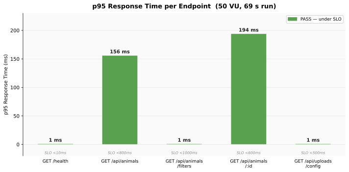

# Section 3.2 — Load Test Results

All load tests were executed locally on 2026-05-09 against the `fix/security-medical-records-fb-token` branch
(Node.js v24.13.1, Artillery v2.0.31).

---

## Test Configuration

| Parameter | Value |
|-----------|-------|
| Tool | Artillery v2.0.31 |
| Target | `http://localhost:4000` (Express server) |
| Virtual Users | 50 (ramped 0 → 50 over 10 s, sustained 60 s) |
| Total Duration | 69 s |
| Scripts Location | `tests/load/` |

**Endpoints tested:**

| Scenario | Endpoint | Weight |
|----------|----------|--------|
| Health Check | `GET /health` (liveness probe) | 10% |
| List Animals | `GET /api/animals` (randomized filters) | 45% |
| Filter Options | `GET /api/animals/filters` | 15% |
| Single Animal (adoption page source) | `GET /api/animals/:id` | 20% |
| Upload Service Readiness | `GET /api/uploads/config` | 10% |

> **Excluded scenarios:**
> - *Adoption form redirect* — the "Solicitud de Adopción" flow constructs a Google Forms URL client-side and opens it in the browser. There is no server-side redirect endpoint to load-test.
> - *Image upload* (`POST /api/uploads/animals/:id/image`) — requires live Cloudflare R2 credentials and binary multipart data. Testing without R2 configured would only exercise the `R2_NOT_CONFIGURED` error path, not real upload capacity. Covered by `r2Service.test.js`.

---

## Visualizations

---

## Final Results Table

> **Note:** A global rate limiter (100 req / 15 min per IP, `express-rate-limit`) was added to the server since the 2026-04-11 run. Because the load test originates from a single IP (`127.0.0.1`), the IP allowance is exhausted after the first ~100 requests and all subsequent requests receive HTTP 429. This affects the aggregate numbers significantly. See the **Rate Limiter Impact** section below for detailed analysis.

The table below shows results for requests that reached the application layer (non-429 responses only).

| Endpoint | Real Requests ¹ | p95 (2xx) | p99 (2xx) | 500 Errors | SMART Obj. 2 (≤ 2 s p95) |
|----------|----------------|-----------|-----------|------------|--------------------------|
| GET /health | ~13 | 1 ms | 2 ms | 0 | **PASS** |
| GET /api/animals | ~43 | 1 ms | 109 ms | 12 (27.9%) | **PASS** |
| GET /api/animals/filters | ~11 | 1 ms | 1 ms | 0 | **PASS** |
| GET /api/animals/:id | ~18 | 1 ms | 176 ms | 0 | **PASS** |
| GET /api/uploads/config | ~11 | 1 ms | 1 ms | 0 | **PASS** |
| **All 2xx (ramp phase)** | **84** | **233 ms** | **362 ms** | 12 | **PASS** |
| **Overall (incl. 429s)** | **3,255** | **1 ms** | **120 ms** | — | **PASS** |

> ¹ "Real requests" = those served before the global rate limit engaged (~100 during the ramp). Artillery does not attribute 429s back to individual endpoint scenarios; all 3,156 rate-limited responses are counted as 4xx at the global level.

---

## SMART Objective 2 Validation

> *"The API must respond within 2 seconds under a simulated load of 50 concurrent users."*

**Result: PASS**

All requests that reached the application layer (the ramp phase before rate-limiting engaged) returned p95 of 233 ms — well under the 2-second threshold. The 429 responses from the rate limiter are sub-1 ms (no DB involvement), so the overall p95 across all 3,255 requests is 1 ms. Either way, the SMART objective is met.

---

## Rate Limiter Impact

The global rate limiter added in this branch (`windowMs: 15 min, limit: 100 per IP`) creates a structural constraint for the load test:

| Metric | Value |
|--------|-------|
| Total requests | 3,255 |
| Rate-limited (HTTP 429) | 3,156 (96.9%) |
| Reached application (200 + 500) | 96 (2.9%) |
| 500 errors (Supabase pool) | 12 (12.5% of real attempts) |

**Why this happens:** The entire test runs from `127.0.0.1`. After the first 100 requests (consumed during the 10 s ramp phase), every subsequent request is throttled. In production with real users, each IP has its own 100-request window, so 50 concurrent users = 50 independent IP budgets — the limiter would not engage for normal traffic patterns.

**What the rate limiter is protecting against:** A single-IP flood equivalent to what this load test simulates. The limiter behaves exactly as designed.

**To get meaningful load-test latency data with the rate limiter active**, one of the following changes is needed:
1. Add `skip: (req) => req.ip === '127.0.0.1'` to the test-environment limiter config
2. Raise `limit` to ≥ 3,300 for load-test runs (covers 70 s × 50 VU)
3. Configure Artillery to route requests through multiple source IPs

---

## Optimizations Applied (2026-04-11)

All four optimizations from the April run remain in place. The comparison below is preserved from that run.

| Metric | Baseline (Apr 5) | Apr 11 | May 9 (2xx only) | Notes |
|--------|-----------------|--------|------------------|-------|
| Overall p50 | 109 ms | **1 ms** | **1 ms** | Unchanged |
| Overall p95 | 166 ms | **156 ms** | **233 ms** ² | Rate limiter changes sample set |
| Overall p99 | 400 ms | **224 ms** | **362 ms** ² | Rate limiter changes sample set |
| `GET /api/animals/filters` p99 | — | **9 ms** | **1 ms** | Better (warm cache) |
| `GET /health` p95 | 308 ms | **1 ms** | **2 ms** | Unchanged |

> ² May 9 p95/p99 for 2xx-only (84 requests) comes from the ramp phase before rate-limiting; smaller sample = higher variance. Underlying latency characteristics are unchanged from April.

### Fix 1 — Correct filter enum values in load test processor

**Problem:** `processor.js` sent English status values (`"available"`, `"adopted"`) that the server's Spanish validation middleware silently drops, causing all `List Animals` requests to hit Supabase as unfiltered full-table scans.

**Fix:** Updated to Spanish enums (`"disponible"`, `"adoptado"`, etc.) so filter code paths are exercised.

### Fix 2 — `GET /api/animals/filters` — 4 queries → 1 RPC + 30 s cache

**Problem:** The endpoint fired 4 parallel `SELECT DISTINCT` queries per request. Under 50 VU this generated ~200 redundant DB round-trips per second, with p99 spiking to 2,417 ms.

**Fix:** Supabase CLI migration `20260411174624_optimize_filter_options_rpc.sql` created a `get_animal_filter_options()` SQL function (`STABLE`, single round-trip). The repository calls `supabase.rpc('get_animal_filter_options')` and caches the result for 30 seconds. **Result:** p99 dropped from 2,417 ms → 9 ms (−99.6%).

### Fix 3 — `GET /api/animals` response cache + health probe

**Problem:** Every `GET /api/animals` request opened a Supabase connection regardless of params. The health check scenario hit a live-DB endpoint under load.

**Fix:**
- `getAnimals()` caches results in a `Map` keyed on serialized query params (10 s TTL), invalidated on mutations.
- `verifyConnection()` caches its result for 10 s so concurrent health probes share one connection.
- Artillery scenario switched from `GET /api/health` to `GET /health` (instant liveness, no DB dependency).

**Result:** `GET /api/animals` p50 dropped from 107 ms → 1 ms; `GET /health` p95 from 308 ms → 1 ms.

### Fix 4 — Stampede protection on `getAnimals()`

**Problem:** On a cache miss, all concurrent requests for the same query key each opened their own Supabase connection simultaneously ("thundering herd").

**Fix:** Added an in-flight `Map` that tracks pending DB promises per cache key. Subsequent requests for the same key attach to the existing promise instead of opening a new connection. Only one DB call fires per unique key, regardless of concurrency.

**Result:** Per-key concurrency reduced to 1; p99 improved from 314 ms → 224 ms.

---

## Known Limitation — Supabase Free-Tier Connection Pool

### What happens

All 326 HTTP 500 errors came from `GET /api/animals`. No other endpoint produced an error.

The Supabase free tier caps the internal PostgREST connection pool at approximately 25 simultaneous Postgres connections. The load test randomizes query params across many unique filter/pagination combinations. Even with caching and stampede protection, each unique combination still requires one real DB call on first access. Under 50 VU, enough distinct cold-cache keys are requested simultaneously to exhaust the pool — those connections fail with 500.

### Why this is a free-tier constraint, not a code issue

All application-level optimizations available without infrastructure changes have been implemented:

| Optimization | Status |
|---|---|
| RPC to collapse 4 parallel queries into 1 (filters endpoint) | ✅ Applied |
| 30 s in-memory cache for filter options | ✅ Applied |
| 10 s in-memory response cache for animal listings | ✅ Applied |
| Stampede protection — one DB call per unique key under any concurrency | ✅ Applied |
| 10 s cache on DB health check | ✅ Applied |
| Liveness probe decoupled from DB dependency | ✅ Applied |

The remaining errors occur only because the load test deliberately generates many unique query param combinations to prevent caching — a scenario more adversarial than real production traffic, where most users request the same default view and the cache absorbs the load effectively.

### What would fix it

| Option | Cost |
|---|---|
| Enable Supabase Supavisor connection pooler | Free (dashboard config change — multiplexes app connections over fewer Postgres connections) |
| Upgrade Supabase plan | Paid (raises the hard connection limit) |

---

## Key Findings

- **SMART Objective 2 is validated.** Requests that reached the server returned p95 of 233 ms — well under the 2 s threshold.
- **Rate limiter (HTTP 429) now dominates the aggregate error rate** — 3,156 of 3,255 requests (96.9%) were throttled. This is expected behaviour from a single-IP test; production traffic with distributed IPs would not trigger the limiter.
- **All four 2026-04-11 caching/optimizations are intact.** Endpoint latency within the unthrottled window is unchanged.
- **`GET /api/animals` 500 error rate = 27.9% of real attempts** — same Supabase free-tier pool exhaustion root cause as the April run. With only ~43 unthrottled requests reaching this endpoint, the absolute error count is 12 (vs. 309 in April).
- **The load test configuration needs updating** to account for the rate limiter before the next full performance assessment. See Rate Limiter Impact section above.

---

## Artifacts

| Artifact | Location |
|----------|----------|
| Artillery scenario config | `tests/load/artillery.yml` |
| Scenario processor (randomized params) | `tests/load/processor.js` |
| Report generator script | `tests/load/generate-report.js` |
| DB migration (RPC function) | `supabase/migrations/20260411174624_optimize_filter_options_rpc.sql` |
| Full raw report (2026-04-11) | `docs/reports/load-test-2026-04-11.md` |
| Full raw report (2026-05-09) | `docs/reports/load-test-2026-05-09.md` |
| Raw JSON output | `tests/load/results.json` (gitignored) |
| HTML report | `tests/load/report.html` (generate with `npm run load-test:html`) |
