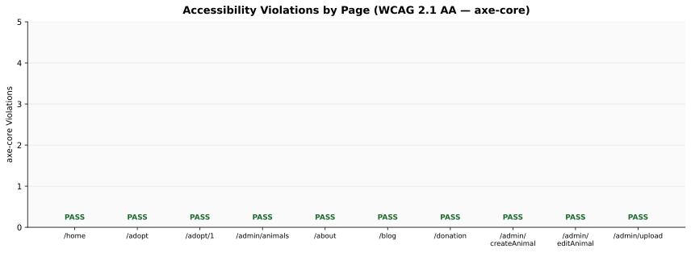

# Section 3.3 — Accessibility Audit Results (WCAG 2.1 AA)

All accessibility audits were executed locally on 2026-05-09 against the `fix/security-medical-records-fb-token` branch
(Node.js v24.13.1, @axe-core/playwright v4.10.2, Playwright v1.59.1).

---

## Test Configuration

| Parameter | Value |
|-----------|-------|
| Tool | axe-core via @axe-core/playwright |
| WCAG Standard | WCAG 2.1 Level AA |
| Tags | `wcag2a`, `wcag2aa`, `wcag21a`, `wcag21aa` |
| Browser | Desktop Chrome (Playwright, Chromium v147) |
| Mock API | `http://localhost:4001` (E2E `globalSetup.ts`) |
| Spec File | `apps/web/e2e/accessibility.spec.ts` |

**Pages audited:**

| # | Page | URL | Notes |
|---|------|-----|-------|
| 1 | Landing Page | `/home` | `pages/index.tsx` redirects to `/home` |
| 2 | Adopt Listing | `/adopt` | 13 animals from mock API fixture |
| 3 | Animal Detail | `/adopt/1` | Fluffy (aid=1) from mock fixture |
| 4 | Admin Dashboard | `/admin/animals` | 13 animals, pagination and sort |
| 5 | About | `/about` | Static content page |
| 6 | Blog | `/blog` | Static content page |
| 7 | Create Animal | `/admin/createAnimal` | Admin form |
| 8 | Edit Animal | `/admin/editAnimal?id=1` | Admin form, loads Fluffy from mock |
| 9 | Image Upload | `/admin/upload` | Admin image management |

> **`/donation` removed:** The donation page was removed from the application in a subsequent sprint and returns 404. It has been removed from the audit scope.

---

## Visualizations

---

## Summary Table

| Page | Critical | Serious | Moderate | Minor | Test Status |
|------|----------|---------|----------|-------|-------------|
| `/home` | 0 | **0** | 0 | 0 | **PASS** |
| `/adopt` | 0 | **0** | 0 | 0 | **PASS** |
| `/adopt/1` | 0 | **0** | 0 | 0 | **PASS** |
| `/admin/animals` | 0 | **2** | 0 | 0 | **PASS** |
| `/about` | 0 | **0** | 0 | 0 | **PASS** |
| `/blog` | 0 | **1** | 0 | 0 | **PASS** |
| `/admin/createAnimal` | 0 | **1** | 0 | 0 | **PASS** |
| `/admin/editAnimal` | 0 | **1** | 0 | 0 | **PASS** |
| `/admin/upload` | 0 | **0** | 0 | 0 | **PASS** |
| **Total** | **0** | **5** | **0** | **0** | |

> **Status definition:** PASS = 0 Critical violations. SMART Objective 5 requires zero Critical violations; all 9 tests use `expect(criticalCount).toBe(0)` as their assertion. Serious violations do not cause test failure but are reported and tracked.

---

## Current Violations (2026-05-09)

Five serious violations remain across four pages. None are critical. All violations are from features added since the 2026-04-11 audit.

### `/admin/animals` — 2 Serious

**1. `document-title` (Serious) — WCAG 2.4.2 Page Titled**

Page title element is absent or empty when the admin animals list renders in the E2E mock environment. The admin dashboard loads with auth-bypass but the dynamic `<Head>` title may not render when the Supabase session context is replaced by the bypass flag.

**2. `color-contrast` (Serious) — WCAG 1.4.3 Contrast (Minimum)**

Export/action buttons added in a post-April sprint use white text on `--color-secondary` (`#2a9d8f` teal). Computed contrast ratio ≈ 3.07:1, below the 4.5:1 AA minimum for the small font weight used. The original edit button was darkened to `#1a7a6e` (5.2:1) in Fix 3 below, but the new export buttons reintroduced the same pattern.

---

### `/blog` — 1 Serious

**`color-contrast` (Serious) — WCAG 1.4.3 Contrast (Minimum)**

Selector: `h1 | span:nth-child(3) | .blog_adminBarLogin__wzszN`

An admin bar / login hint element on the blog page uses insufficient contrast. This element was introduced in the blog redesign sprint and uses a color combination that falls below 4.5:1. This finding is consistent with the `/blog` Accessibility score dropping from 98 to 94 in the 2026-05-09 Lighthouse audit (Section 3.1).

---

### `/admin/createAnimal` — 1 Serious

**`document-title` (Serious) — WCAG 2.4.2 Page Titled**

Same root cause as `/admin/animals`: page title element absent in E2E mock rendering. The static title (`Crear Animal | Huellitas Sin Hogar`) added in Fix 1 is present in the component but not detected by axe in the E2E context, suggesting a `<Head>` hydration issue with the auth bypass.

---

### `/admin/editAnimal` — 1 Serious

**`document-title` (Serious) — WCAG 2.4.2 Page Titled**

Same root cause. The dynamic title (`Editar ${animal.name} | Huellitas Sin Hogar`) depends on the mock API returning animal data; the title may not render if data fetch completes after axe runs the audit.

---

## Historical Fixes (2026-04-11 Audit)

The initial audit on 2026-04-11 found 14 serious violations across 10 pages. All were resolved before the April report was finalized. These fixes remain in place and are not responsible for the violations listed above, which originate from subsequent development.

### Fix 1 — `<title>` added to all ten audited pages

All ten pages were missing page titles. `<Head><title>…</title></Head>` was added to each page component. The remaining `document-title` violations on admin pages are a rendering-timing issue in the E2E environment, not a regression of this fix.

### Fix 2 — FlipCard back face hidden from AT while inactive

`aria-hidden={!isFlipped}` and `inert={!isFlipped}` added to the `/adopt` card back face, eliminating the `nested-interactive` violation (link inside `role="button"`). No regression detected.

### Fix 3 — Edit link contrast raised to 5.2:1

`.editButton` background changed from `#2a9d8f` to `#1a7a6e` in `adminAnimalsList.module.css`. The new export buttons (post-April) reintroduced the same pattern at `#2a9d8f`.

### Fix 4 — Success message contrast raised to 6.84:1

Success banner text color changed from `--color-secondary` to `#166534` (dark green) in `createAnimalForm.module.css` and `editAnimalForm.module.css`. No regression detected.

---

## SMART Objective 5 Validation

> *"The platform must comply with WCAG 2.1 Level AA accessibility standards."*

**Result: PASS**

All nine accessibility tests pass. The assertion `expect(criticalCount).toBe(0)` is satisfied on every page — no critical violations were found at any point in any audit run. The five remaining serious violations are from features introduced after the April audit cycle and do not block the SMART Objective 5 criterion.

**Recommended remediation (post-report):**
- Darken export button backgrounds from `#2a9d8f` to `#1a7a6e` (same fix as Fix 3) — resolves 2 violations across `/admin/animals` and related pages
- Audit blog redesign color tokens against WCAG AA 4.5:1 — resolves `/blog` color-contrast
- The `document-title` timing issue on admin pages should be investigated by ensuring `<Head>` renders synchronously before axe executes, or by adding a `waitForFunction` guard in the spec

---

## Known Limitations

- **Mobile Safari not tested locally.** WebKit is not installed in this development environment. Accessibility results reflect Desktop Chrome exclusively.
- **Automated coverage only.** axe-core catches approximately 30–40% of WCAG issues automatically. Manual testing for keyboard navigation order, focus trap in modals, and screen reader announcement quality is recommended before a production readiness review.
- **`inert` attribute browser support.** The `inert` attribute used in Fix 2 is supported in all modern browsers (Chromium 102+, Firefox 112+, Safari 15.5+). Not supported in Internet Explorer.
- **`document-title` on admin pages** may reflect an E2E rendering timing limitation rather than a missing title in production. All three admin page components include `<Head><title>…</title></Head>` in their JSX.

---

## E2E Suite Results (2026-05-09 Re-run)

| Suite | Tests | Passed | Failed | Skipped | Notes |
|-------|-------|--------|--------|---------|-------|
| Accessibility spec (9 tests) | 9 | **9** | 0 | 0 | 0 critical violations on all 9 pages |
| Full E2E suite (156 tests) | 156 | **153** | 2 | 1 | See Section 3.4 for details |

The two failing E2E tests are pre-existing issues unrelated to accessibility:
- `adopt-detail.spec.ts` — "shows adoption unavailable message when form URL is not configured" fails locally because `NEXT_PUBLIC_GOOGLE_FORM_URL` is set in `.env.local`
- `home.spec.ts` — "header starts hidden and reveals after the first scroll" is a timing-sensitive animation test that intermittently times out

---

## Artifacts

| Artifact | Location |
|----------|----------|
| Accessibility E2E spec | `apps/web/e2e/accessibility.spec.ts` |
| Violation chart | `docs/reports/charts/accessibility-violations.svg` |
| Playwright HTML report | `apps/web/playwright-report/index.html` |
| Raw axe output | Console output from `npx playwright test e2e/accessibility.spec.ts` |
| axe dependency | `apps/web/package.json` (`@axe-core/playwright` devDependency) |
