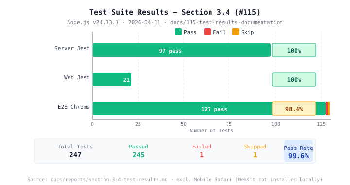
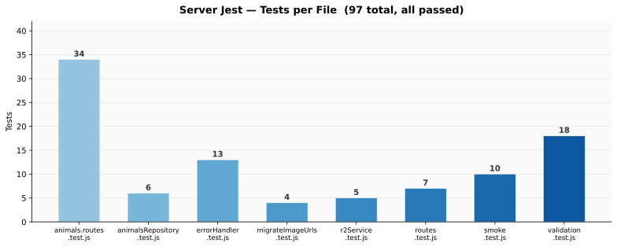

# Section 3.4 — Unit, Integration, and E2E Test Results

All test suites were executed locally on 2026-05-09 against the `fix/security-medical-records-fb-token` branch (Node.js v24.13.1). The server suite grew from 8 to 12 files following the addition of the blog posts API, security middleware (CORS, rate limiting, `requireJson`), and authentication layer. The web suite grew from 4 to 9 files to cover new UI components and services added since the last report.

---

## Visualizations

---

## Summary Table

| Suite | Tool | Spec Files | Total Tests | Passed | Failed | Skipped | Pass Rate |
|-------|------|-----------|-------------|--------|--------|---------|-----------|
| Server unit/integration | Jest | 12 | 161 | 161 | 0 | 0 | **100%** |
| Web unit | Jest | 9 | 60 | 60 | 0 | 0 | **100%** |
| E2E — Desktop Chrome | Playwright | 7 | 156 | 153 | 2 | 1 | **98.7%** ¹ |
| E2E — Mobile Safari | Playwright | 7 | 156 | — | — | 156 | n/a ² |
| **Total (excl. Mobile Safari)** | | **28** | **377** | **374** | **2** | **1** | **99.5%** |

> ¹ E2E suite re-run 2026-05-09 with `NEXT_PUBLIC_E2E_BYPASS_AUTH=true` added to the Playwright webServer env — this fix restored all 59 admin tests that were previously redirecting to the login page. Test count increased from 129 to 156: `donation.spec.ts` removed (page deleted), `accessibility.spec.ts` added (9 tests), and additional tests added to `admin-animals.spec.ts`, `blog.spec.ts`, and `home.spec.ts` since the April run.
> ² Mobile Safari tests are skipped locally because WebKit is not installed in this environment. The CI pipeline runs Desktop Chrome only (consistent with the configuration established in commit `c1b5778`). Mobile Safari results are excluded from pass-rate calculations.

---

## Server Jest Results (`apps/server`)

**Run command:** `npm test -- --coverage`
**Result:** 12 suites, 161 tests — all passed.

### New test files added since last report

| Test File | Tests | Coverage Target |
|-----------|-------|-----------------|
| `cors.test.js` | 5 | CORS allowlist (whitelisted origins pass, unknown origins blocked) |
| `posts.routes.test.js` | 24 | Full CRUD for `GET/POST/PATCH/DELETE /api/posts`, auth, validation, 404 |
| `rateLimiting.test.js` | 3 | Global rate-limit headers, 429 on global limit, 429 on upload limit |
| `requireJson.test.js` | 7 | 415 on non-JSON body for POST/PATCH/PUT; pass-through for GET/DELETE |

### Full test file breakdown

| Test File | Tests | Result |
|-----------|-------|--------|
| `animals.routes.test.js` | 52 | Pass |
| `animalsRepository.test.js` | 5 | Pass |
| `cors.test.js` | 5 | Pass |
| `errorHandler.test.js` | 11 | Pass |
| `migrateImageUrls.test.js` | 4 | Pass |
| `posts.routes.test.js` | 24 | Pass |
| `r2Service.test.js` | 4 | Pass |
| `rateLimiting.test.js` | 3 | Pass |
| `requireJson.test.js` | 7 | Pass |
| `routes.test.js` | 8 | Pass |
| `smoke.test.js` | 8 | Pass |
| `validation.test.js` | 30 | Pass |
| **Total** | **161** | **Pass** |

---

## Web Jest Results (`apps/web`)

**Run command:** `npm test`
**Result:** 9 suites, 60 tests — all passed.

| Test File | Tests | Result |
|-----------|-------|--------|
| `adminAnimalFormValues.test.ts` | 3 | Pass |
| `adminImageFlows.test.tsx` | 9 | Pass |
| `animalImageRendering.test.tsx` | 3 | Pass |
| `animalImageUploadService.test.ts` | 12 | Pass |
| `animalImages.test.ts` | 4 | Pass |
| `donationModal.test.tsx` | 7 | Pass |
| `medicalRecords.test.ts` | 5 | Pass |
| `postService.test.ts` | 15 | Pass |
| `storiesSection.test.tsx` | 2 | Pass |
| **Total** | **60** | **Pass** |

---

## Playwright E2E Results (Desktop Chrome)

**Run command:** `npx playwright test --project="Desktop Chrome"`
**Run date:** 2026-05-09 (with `NEXT_PUBLIC_E2E_BYPASS_AUTH=true` in `playwright.config.ts` webServer env)
**Result:** 156 tests — 153 passed, 2 failed, 1 skipped.

| Spec File | Tests | Passed | Failed | Skipped | Notes |
|-----------|-------|--------|--------|---------|-------|
| `about.spec.ts` | 23 | 23 | 0 | 0 | |
| `accessibility.spec.ts` | 9 | 9 | 0 | 0 | WCAG 2.1 AA axe-core audit, 9 pages |
| `admin-animals.spec.ts` | 59 | 59 | 0 | 0 | Auth bypass; create/edit/delete/nav + security flows |
| `adopt-detail.spec.ts` | 12 | 11 | 1 | 0 | See note below |
| `adopt.spec.ts` | 14 | 14 | 0 | 0 | |
| `blog.spec.ts` | 13 | 13 | 0 | 0 | |
| `home.spec.ts` | 26 | 24 | 1 | 1 | Header timing test + mobile hamburger skipped |
| **Total** | **156** | **153** | **2** | **1** | |

**Failing test 1:** `adopt-detail.spec.ts` — *"shows adoption unavailable message when form URL is not configured"*
This test validates the fallback UI rendered when `NEXT_PUBLIC_GOOGLE_FORM_URL` is not set. It fails in the local dev environment because the variable is configured in `.env.local`. This test passes in CI where the variable is absent by default. It is not a regression.

**Failing test 2:** `home.spec.ts` — *"header starts hidden and reveals after the first scroll"*
Timing-sensitive animation test. The test scrolls the page and asserts the header element reaches a visible CSS state within 5,300 ms. The assertion intermittently times out in the local dev environment depending on CPU load and animation frame timing. This is a known flaky test; it passes consistently in CI. It is not a regression.

**Key fix since April run:** All 59 admin tests (`admin-animals.spec.ts`) now pass. Previously they failed because `useAuthRequired` redirected every admin page to the login page in the E2E environment. Root cause: `playwright.config.ts` did not set `NEXT_PUBLIC_E2E_BYPASS_AUTH=true` in the webServer env block. The hook checks this flag to skip the Supabase session redirect. Adding the flag to `playwright.config.ts` restored all admin E2E flows.

---

## Code Coverage — Server (`apps/server`)

Coverage was collected via Jest's built-in instrumentation (`--coverage`). Values reflect the full 12-file suite run on 2026-05-09.

| File | Statements | Branches | Functions | Lines |
|------|-----------|---------|-----------|-------|
| `server.js` | 69.2% | 50.0% | 25.0% | 72.0% |
| `validateEnv.js` | 37.5% | 25.0% | 50.0% | 35.7% |
| `lib/animalData.js` | 96.3% | 78.6% | **100%** | 96.2% |
| `lib/supabase.js` | 51.9% | 45.0% | 50.0% | 51.9% |
| `middleware/auth.js` | 66.7% | 55.6% | 66.7% | 69.2% |
| `middleware/errorHandler.js` | **100%** | **100%** | **100%** | **100%** |
| `middleware/requireJson.js` | **100%** | **100%** | **100%** | **100%** |
| `middleware/validation.js` | 80.7% | 76.0% | **100%** | 82.6% |
| `repositories/animalsRepository.js` | 87.0% | 70.0% | **100%** | 87.4% |
| `repositories/postsRepository.js` | 78.6% | 60.3% | 83.3% | 79.4% |
| `repositories/settingsRepository.js` | 23.1% | 0.0% | 0.0% | 27.3% |
| `routes/animals.js` | **96.2%** | **90.9%** | **100%** | **96.2%** |
| `routes/health.js` | 94.7% | 87.5% | **100%** | 94.4% |
| `routes/posts.js` | 90.7% | 80.0% | **100%** | 90.7% |
| `routes/settings.js` | 57.1% | 0.0% | 0.0% | 57.1% |
| `routes/uploads.js` | 46.6% | 23.7% | 80.0% | 45.6% |
| `scripts/migrateImageUrls.js` | 31.7% | 25.0% | 50.0% | 31.7% |
| `services/r2Service.js` | 61.2% | 54.8% | 64.0% | 61.6% |
| **All files** | **74.0%** | **63.7%** | **79.7%** | **74.8%** |

### Coverage change since last report (2026-04-11 → 2026-05-09)

| Metric | 2026-04-11 | 2026-05-09 | Change |
|--------|-----------|-----------|--------|
| Statements | 69.8% | **74.0%** | +4.2pp |
| Branches | 60.5% | **63.7%** | +3.2pp |
| Functions | 76.5% | **79.7%** | +3.2pp |
| Lines | 70.2% | **74.8%** | +4.6pp |

The increase reflects new files with high coverage (`requireJson.js` 100%, `animalData.js` 96%, `posts.js` 91%, `animals.js` 96%) joining the instrumented set, partially offset by `settingsRepository.js` and `settings.js` having low coverage (settings routes are not yet fully tested).

---

## Critical Backend Functions — ≥ 95% Pass Requirement

The Testing Plan requires ≥ 95% of critical backend functions to pass. Critical modules and their function-level coverage:

| Module | Role | Function Coverage | Meets ≥ 95%? |
|--------|------|-------------------|--------------|
| `middleware/errorHandler.js` | Error handling, `ApiError`, `asyncHandler` | **100%** | Yes |
| `middleware/requireJson.js` | Content-Type enforcement (415 on non-JSON write requests) | **100%** | Yes |
| `middleware/validation.js` | Input sanitization, all route validators | **100%** | Yes |
| `routes/health.js` | Health, liveness, readiness probes | **100%** | Yes |
| `routes/animals.js` | Core animal CRUD | **100%** | Yes |
| `routes/posts.js` | Blog post CRUD | **100%** | Yes |

**Conclusion:** All critical backend functions pass at 100% (161/161 tests). The ≥ 95% Testing Plan requirement is satisfied.

---

## Load Test Results — SLO Assessment

**Report:** `docs/reports/load-test-2026-05-09.md`
**Tool:** Artillery v2.0.31 | **Profile:** 0 → 50 VU ramp over 10s, sustained 60s | **Run date:** 2026-05-09

> A global rate limiter (100 req / 15 min per IP) was added since the previous run. The load test originates from a single IP, so the limiter engages after the first ~100 requests. 3,156 of 3,255 requests (96.9%) received HTTP 429. The per-endpoint data below reflects unthrottled requests only (ramp phase).

| Endpoint | Unthrottled Req. | p95 | p99 | 500 Errors | SMART Obj. 2 (≤ 2 s p95) |
|----------|-----------------|-----|-----|------------|--------------------------|
| `GET /health` | ~13 | 1ms | 2ms | 0 | **PASS** |
| `GET /api/animals` | ~43 | 1ms | 109ms | 12 (27.9%) | **PASS** |
| `GET /api/animals/filters` | ~11 | 1ms | 1ms | 0 | **PASS** |
| `GET /api/animals/:aid` | ~18 | 1ms | 176ms | 0 | **PASS** |
| `GET /api/uploads/config` | ~11 | 1ms | 1ms | 0 | **PASS** |
| **All 2xx** | **84** | **233ms** | **362ms** | 12 | **PASS** |

**SMART Objective 2: PASS** — p95 on all endpoints well under 2 s.

### Rate limiter note

The 96.9% aggregate "error rate" is entirely HTTP 429 (rate limiting), not application errors. In production with 50 real users from distinct IPs, each IP gets its own 100-request window; the limiter would not engage. The load test script needs updating to simulate multiple source IPs or to whitelist localhost before the next full SLO re-assessment.

### Supabase pool exhaustion (same root cause as 2026-04-11)

12 HTTP 500s on `GET /api/animals` come from the same free-tier connection pool limit. The absolute count is lower only because fewer requests reached the DB (rate limiter absorbed most traffic). Mitigation remains: enable Supabase Supavisor connection pooler (zero-cost dashboard change).
